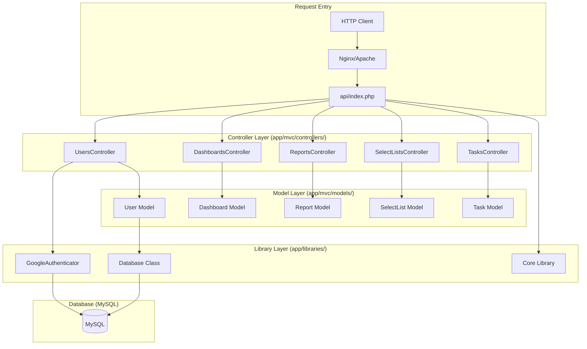
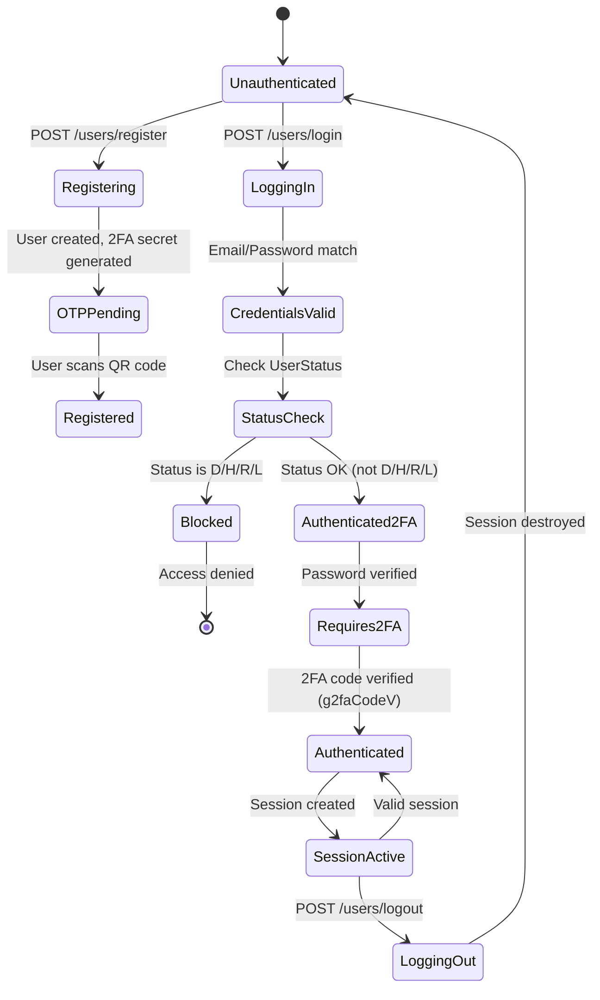
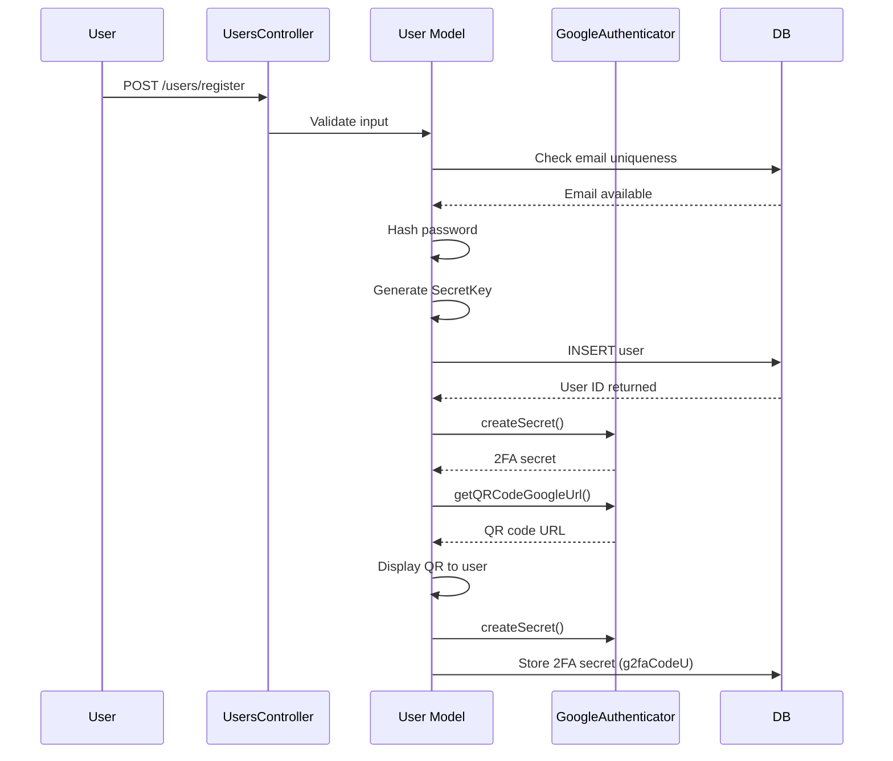
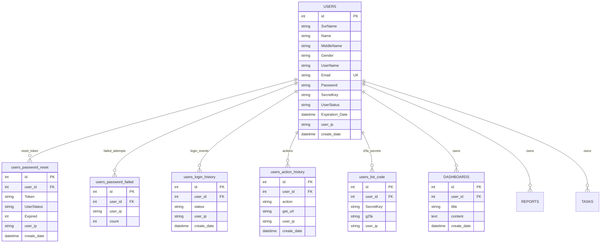
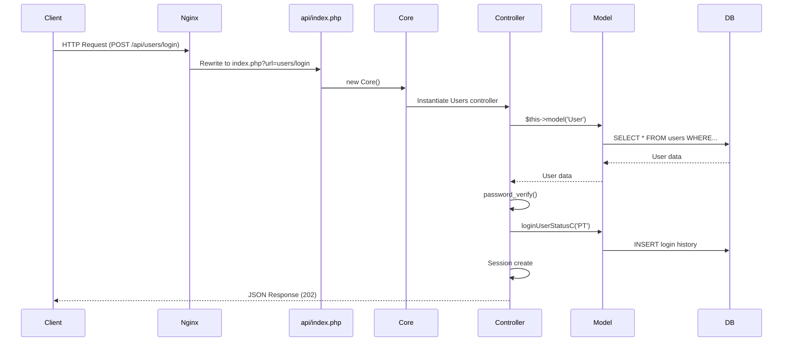
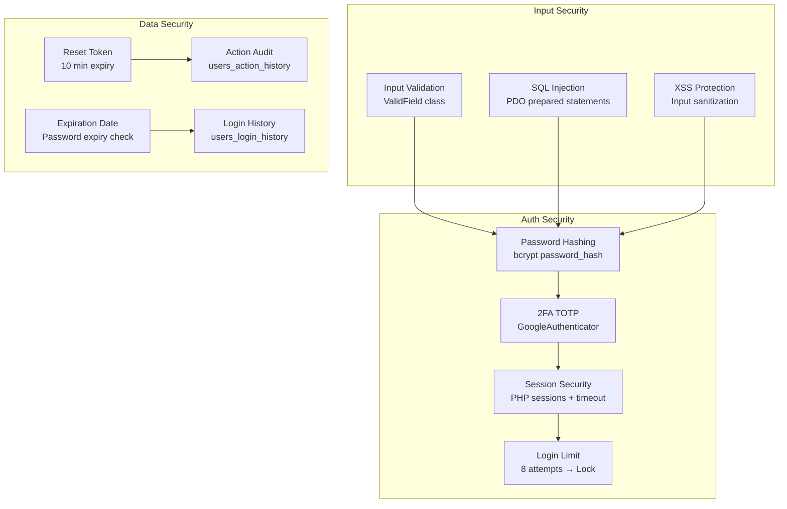

# Architecture Documentation

> rest-api-mvc-php — MVC Layers, Auth Flow, Database Schema

---

## MVC Layer Architecture

### Controller Responsibilities

| Controller | File | Actions |
|------------|------|---------|
| **Users** | `app/mvc/controllers/Users.php` | register, login, resetPassword, checkResetToken, g2faCodeC, g2faCodeV, logout, createUserSession |
| **Dashboards** | `app/mvc/controllers/Dashboards.php` | index, index2, create, edit, delete |
| **Reports** | `app/mvc/controllers/Reports.php` | index, create, edit, delete |
| **SelectLists** | `app/mvc/controllers/SelectLists.php` | index, create, edit, delete |
| **Tasks** | `app/mvc/controllers/Tasks.php` | index, create, edit, delete |

---

## Authentication Flow

### Session + 2FA Authentication

### 2FA Setup Flow

---

## Database Schema

---

## Request Lifecycle

---

## Security Architecture

---

## UserStatus States

| Code | Meaning | Effect |
|------|---------|--------|
| `E` | Enable | User can login |
| `D` | Disable | Login blocked |
| `H` | Hold | Login blocked |
| `R` | Reset | Password reset required |
| `L` | Lock | Account locked (8 failed attempts) |

---

## Roadmap / Known Gaps

Planned work that is not yet implemented, consolidated here from retired
scratch notes (`ToDo`, `Url&Data.txt`) during the 2026-09-17 doc cleanup:

- **Role-Based Access Control (ACL).** A `UserID` / `RoleID` / `PermissionID`
  model was sketched but never built — there is no `roles` or `permissions`
  table in the [current schema](schema.md); all endpoints are gated by
  session auth + 2FA only, with no per-role permission checks.
- **Outbound email.** A `sendMail()` / `save_mail()` PHPMailer+IMAP helper
  exists in `app/helpers/index.php` (SMTP credentials now read from
  `SMTP_USERNAME`/`SMTP_PASSWORD`/`SMTP_FROM_EMAIL`/`SMTP_TEST_RECIPIENT` env
  vars, see `.env.example`) but it is **not called from any controller**.
  Registration and `resetPassword` currently return the reset token/QR data
  in the API response instead of emailing it — wiring `sendMail()` into
  those flows is open work.

---

## Reference

- [README.md](../README.md) — Project overview and API reference
- [API Documentation](../docs/api.md) — Complete endpoint details