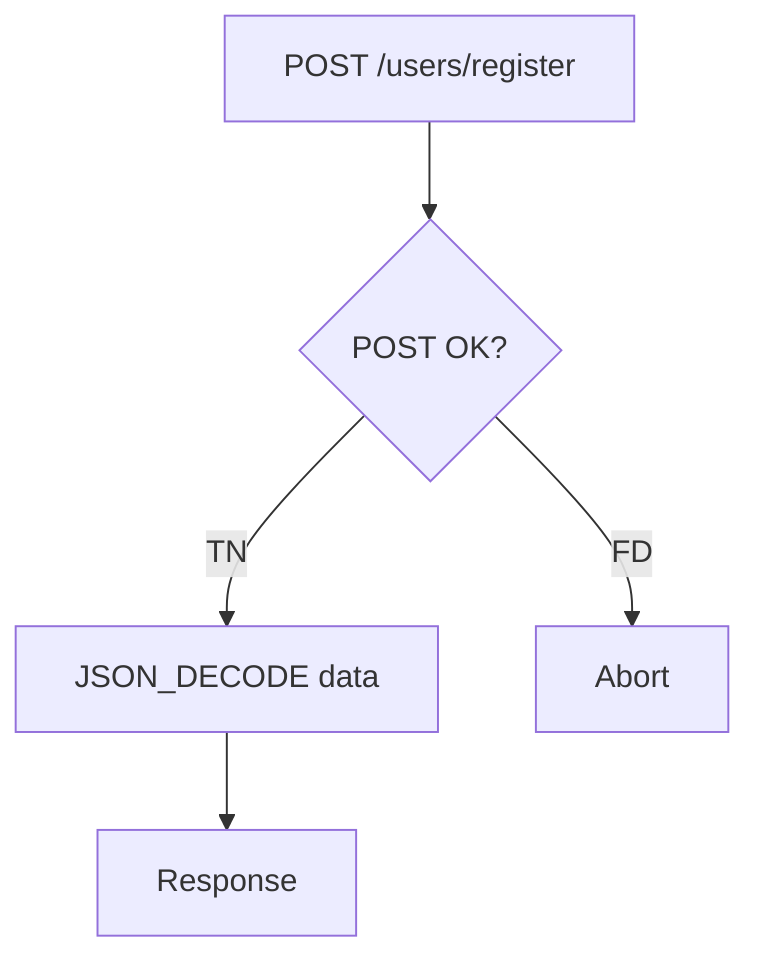
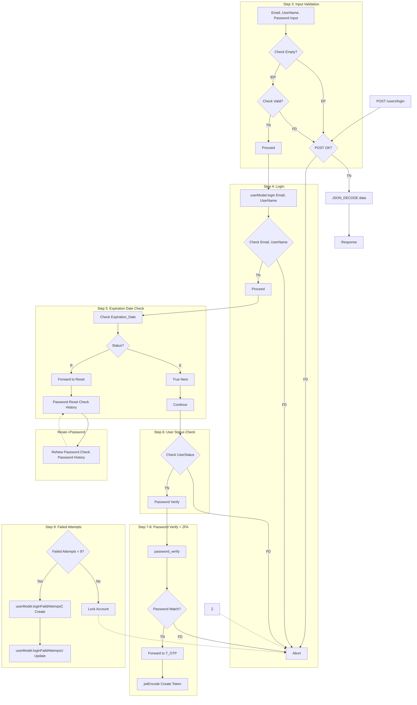
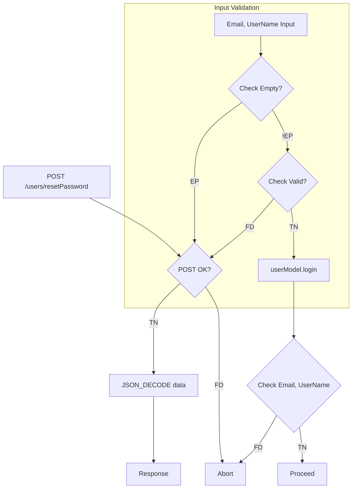
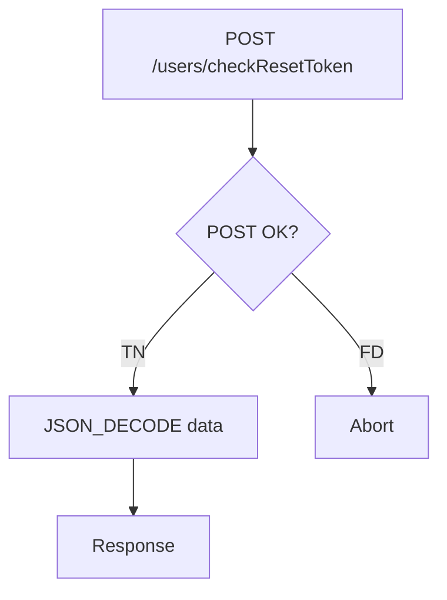
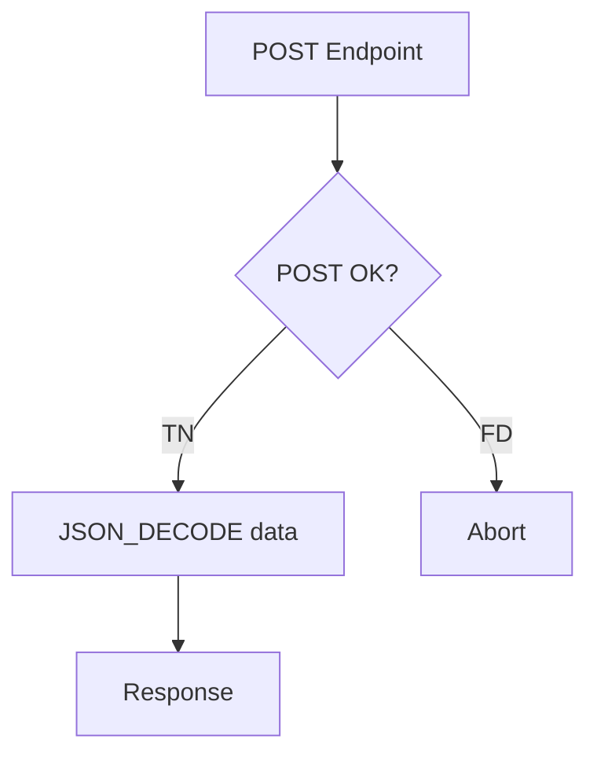

# Auth Flow — Mermaid Flowchart

> Converted from `Documentation.txt` — Auth state machine flow

## State Definitions

| Code | Meaning |
|------|---------|
| `TN` | True Next — proceed to next step |
| `FD` | False Die — abort / fail |
| `RP` | Response |
| `CH` | Check |
| `IP` | Input |
| `EP` | Empty |
| `FR` | Forward |
| `E` | Enable |
| `R` | Reset |
| `D` | Disable |
| `H` | Hold |
| `L` | Lock |

## 0. Register

## 1. Login

## 2. Reset Password

## 3. Check Reset Token

## 4-6. Remaining Endpoints

Each endpoint follows the same pattern:

## Reference

> The raw `Documentation.txt` state-machine notation this page was converted
> from has been retired (2026-09-17 doc cleanup) — this file is now the
> single source of truth for the auth flow.

- [Architecture](../architecture.md) — MVC layers, auth flow state diagram, DB schema
- [API Reference](../docs/api.md) — Endpoint details
