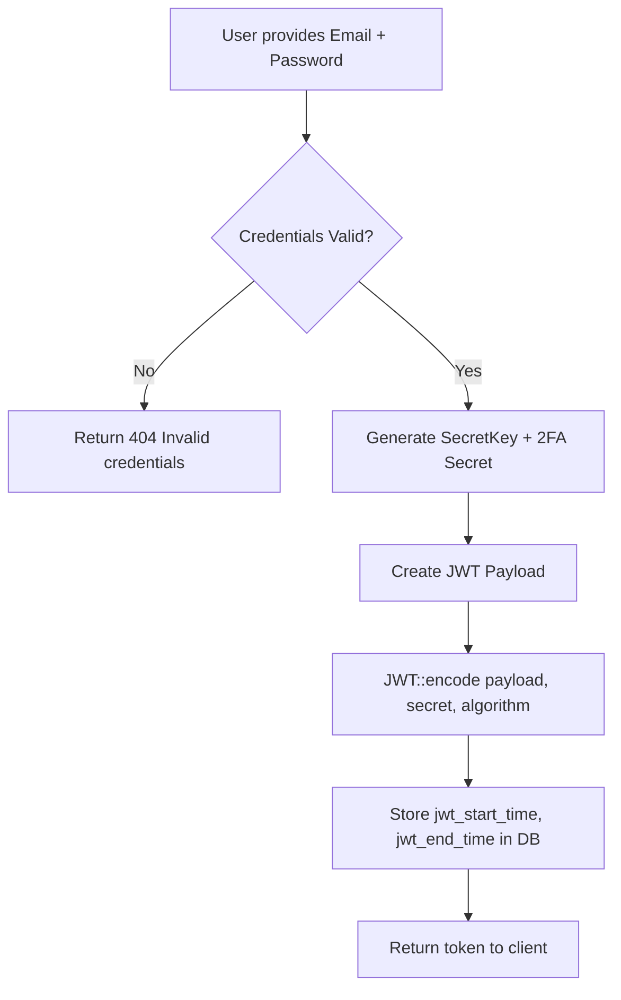
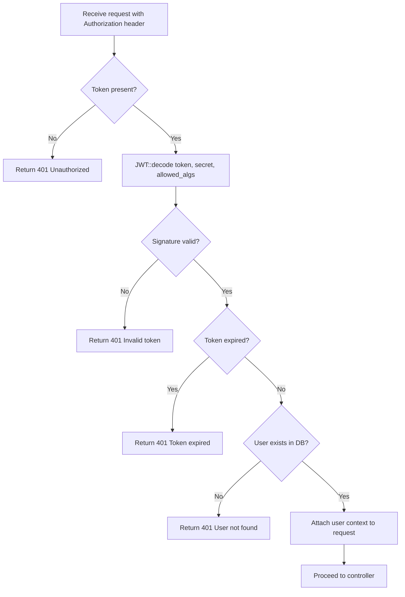
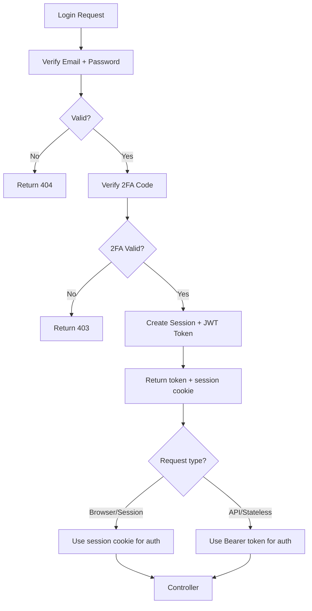

# JWT Authentication Guide

> rest-api-mvc-php — Token flow, middleware, validation

## Overview

**rest-api-mvc-php** includes a Firebase PHP JWT library for JSON Web Token operations. The primary authentication mechanism is PHP Sessions + 2FA (TOTP/Google Authenticator), with JWT support available for stateless API token-based authentication scenarios.

| Component | Detail |
|-----------|--------|
| JWT Library | Firebase PHP JWT (`firebase/php-jwt`) — bundled in `app/libraries/OtherClass/jwt/` |
| Secret Key | `JWT_SECCRET_KEY` constant in `app/config/config.php` |
| Supported Algorithms | HS256, HS384, HS512, ES256, RS256, RS384, RS512 |
| Token Expiry | Configurable via `jwt_end_time` (stored in `users_list_code` table) |

---

## 1. Token Flow

### 1.1 Token Creation



### 1.2 Token Structure

```json
{
  "iss": "rest-api-mvc-php",
  "sub": "user_id",
  "name": "User Name",
  "email": "user@example.com",
  "iat": 1695000000,
  "exp": 1695003600
}
```

### 1.3 Token Validation Flow



### 1.4 Login + JWT Sequence

The login endpoint (`Users::login()`) returns:

| Field | Description |
|-------|-------------|
| `user_id` | User primary key |
| `md51Key` | User SecretKey for 2FA |
| `md52Key` | 2FA secret + random salt |
| `jstKey` | JWT start timestamp (`jwt_start_time`) |
| `jetKey` | JWT end timestamp (`jwt_end_time`) |
| `imgKey` | QR code image for Google Authenticator |

After 2FA verification, a JWT token can be issued for stateless API access:

1. Verify 2FA code against stored secret
2. Create JWT with `iss`, `sub` (user_id), `email`, `iat`, `exp`
3. Sign with `JWT_SECCRET_KEY` using HS256
4. Return token in response body
5. Client includes token in `Authorization: Bearer <token>` header for subsequent requests

---

## 2. Middleware

### 2.1 JWT Validation Middleware

```php
<?php
// app/mvc/middleware/JwtAuthMiddleware.php

class JwtAuthMiddleware
{
    private $secretKey;
    private $allowedAlgorithms = ['HS256'];

    public function __construct()
    {
        $this->secretKey = JWT_SECCRET_KEY;
    }

    public function handle($request, $next)
    {
        $token = $this->extractToken($request);

        if (!$token) {
            return HTTPStatus(401, 0, '/', 'Authorization token required', []);
        }

        try {
            $decoded = \JWT::decode($token, $this->secretKey, $this->allowedAlgorithms);
        } catch (\Firebase\JWT\SignatureInvalidException $e) {
            return HTTPStatus(401, 0, '/', 'Invalid token signature', []);
        } catch (\Firebase\JWT\ExpiredException $e) {
            return HTTPStatus(401, 0, '/', 'Token expired', []);
        } catch (\Firebase\JWT\BeforeValidException $e) {
            return HTTPStatus(401, 0, '/', 'Token not yet valid', []);
        } catch (\DomainException $e) {
            return HTTPStatus(401, 0, '/', 'Invalid token format', []);
        } catch (\InvalidArgumentException $e) {
            return HTTPStatus(401, 0, '/', 'Invalid token parameters', []);
        } catch (\UnexpectedValueException $e) {
            return HTTPStatus(401, 0, '/', 'Token validation failed', []);
        }

        // Attach user context
        $request->user_id = $decoded->sub;
        $request->user_email = $decoded->email;
        $request->jwt_payload = $decoded;

        return $next($request);
    }

    private function extractToken($request)
    {
        $headers = $request->getHeaders();

        if (isset($headers['Authorization'])) {
            $authHeader = $headers['Authorization'];
            if (preg_match('/Bearer\s(\S+)/', $authHeader, $matches)) {
                return $matches[1];
            }
        }

        return null;
    }
}
```

### 2.2 Middleware Registration

Register the middleware in the routing layer (`api/index.php` or a routes file):

```php
// Protected routes require JWT authentication
$protectedRoutes = [
    '/users/profile' => ['GET', 'POST'],
    '/users/update' => ['POST'],
    '/dashboards' => ['GET'],
    '/reports' => ['GET', 'POST'],
];

// Public routes (no auth required)
$publicRoutes = [
    '/users/register' => ['POST'],
    '/users/login' => ['POST'],
    '/users/resetPassword' => ['POST'],
    '/users/checkResetToken' => ['POST'],
];
```

### 2.3 Middleware Lifecycle

| Step | Action | Error Code |
|------|--------|------------|
| 1 | Extract token from `Authorization: Bearer` header | 401 — No token |
| 2 | Decode and verify signature | 401 — Invalid signature |
| 3 | Check token expiry (`exp` claim) | 401 — Token expired |
| 4 | Check token validity time (`nbf`/`iat` claim) | 401 — Not yet valid |
| 5 | Verify user exists in database | 401 — User not found |
| 6 | Attach user context, proceed to controller | 200 — OK |

---

## 3. Validation Rules

### 3.1 Token Validation Checklist

| Rule | Check | Failure Response |
|------|-------|------------------|
| **Signature** | `JWT::decode` verifies HMAC/SHA256 signature against `JWT_SECCRET_KEY` | 401 — Invalid token |
| **Expiry** | `exp` claim > current time (with 60s leeway) | 401 — Token expired |
| **Issuer** | `iss` claim = `rest-api-mvc-php` | 401 — Invalid issuer |
| **Subject** | `sub` claim exists and maps to valid user ID | 401 — User not found |
| **Algorithm** | Algorithm in `allowedAlgorithms` list (HS256) | 401 — Algorithm not allowed |
| **User Status** | User not in Disable/Hold/Lock status | 403 — Account locked |

### 3.2 Algorithm Configuration

```php
// Minimum: HS256 for symmetric signing
$allowedAlgorithms = ['HS256'];

// Recommended for production: RS256 for asymmetric signing
// Requires private key for signing, public key for verification
$allowedAlgorithms = ['RS256'];
```

### 3.3 Expiry Configuration

```php
// Token lifetime in seconds (default: 1 hour)
define('JWT_TOKEN_LIFETIME', 3600);

// Clock skew tolerance in seconds
\JWT::$leeway = 60;
```

### 3.4 Secret Key Rotation

The `JWT_SECCRET_KEY` in `app/config/config.php` should be rotated periodically:

1. Generate new secret key
2. Update `JWT_SECCRET_KEY` constant
3. All existing tokens become invalid (signature mismatch)
4. Clients must re-authenticate with new token
5. Store key in environment variable (not in code) for production

---

## 4. Integration with Session + 2FA Auth

The primary auth flow is session-based with 2FA. JWT serves as an optional stateless layer:



Both auth methods share the same user verification — session auth validates credentials once, and JWT auth validates the same credentials through token verification.

---

## 5. Error Handling

| Exception Class | Trigger | HTTP Response |
|----------------|---------|---------------|
| `SignatureInvalidException` | Token signature mismatch | 401 |
| `ExpiredException` | Token past `exp` claim | 401 |
| `BeforeValidException` | Token before `nbf`/`iat` claim | 401 |
| `DomainException` | Invalid algorithm or key format | 401 |
| `InvalidArgumentException` | Invalid token parameters | 401 |
| `UnexpectedValueException` | General validation failure | 401 |

All exceptions should be caught and converted to standardized JSON error responses:

```json
{
  "status": 401,
  "success": 0,
  "path": "/",
  "message": "Token expired",
  "data": []
}
```

---

## 6. Configuration Reference

| Constant | File | Default | Description |
|----------|------|---------|-------------|
| `JWT_SECCRET_KEY` | `app/config/config.php` | `rest-api-mvc-php123!@#!$!@546asda` | JWT signing secret |
| `SESSION_TIME` | `app/config/config.php` | `1800` | Session timeout (seconds) |
| `DB_HOST` | `app/config/config.php` | `localhost` | Database host |
| `DB_NAME` | `app/config/config.php` | `rest-api-mvc-php` | Database name |

---

## 7. Security Notes

- **Secret Key**: `JWT_SECCRET_KEY` is hardcoded in config.php — move to environment variable in production
- **Algorithm**: Use RS256 (asymmetric) in production to prevent server compromise from token forgery
- **Leeway**: Set `\JWT::$leeway = 60` to handle clock skew between server and client
- **HTTPS**: JWTs must only be transmitted over HTTPS
- **Storage**: Do not store sensitive data in JWT payload (it's base64-encoded, not encrypted)
- **Token Revocation**: Implement a token blacklist in `users_list_code` table for logout/invalidate scenarios

---

## Reference

- [Auth Flow](../docs/auth-flow.md) — Mermaid flowcharts of the auth state machine (retired raw `Documentation.txt` notation, 2026-09-17)
- [Architecture](../docs/architecture.md) — MVC layers, auth state diagram, DB schema
- [API Reference](../docs/api.md) — Endpoint details
- [Config](../app/config/config.php) — Application configuration
- [JWT Library](../app/libraries/OtherClass/jwt/JWT.php) — Firebase PHP JWT implementation
- [Users Controller](../app/mvc/controllers/Users.php) — Auth endpoints
