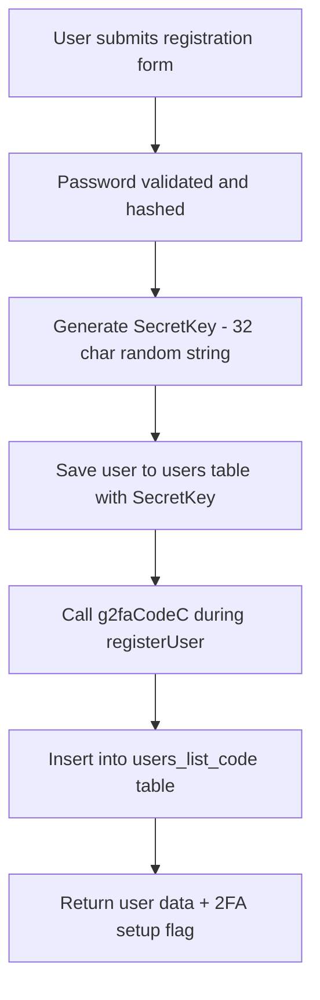
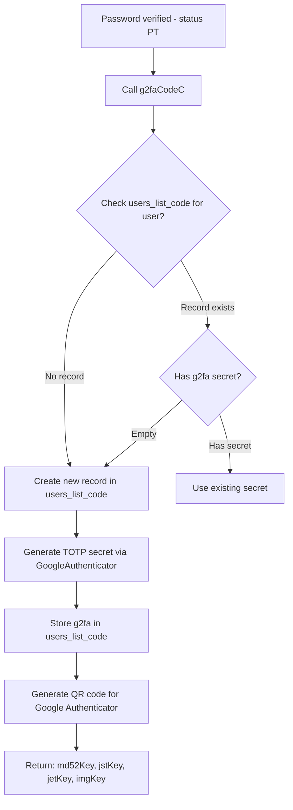
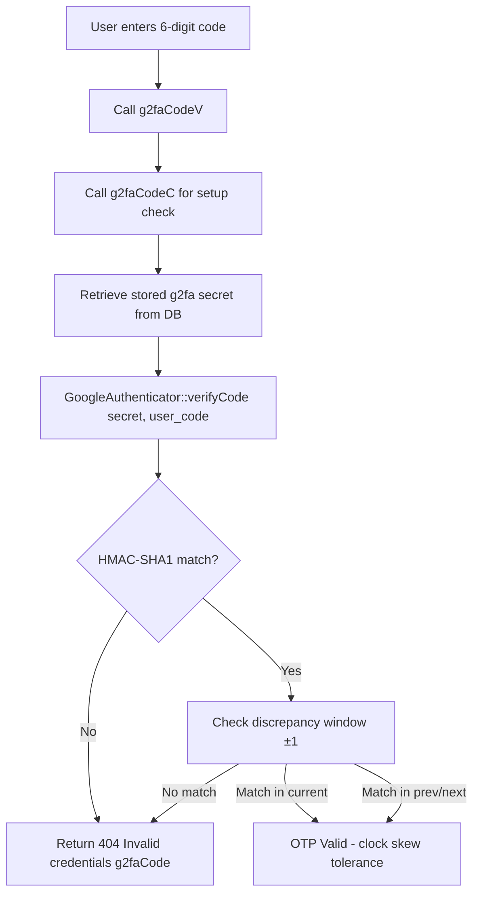
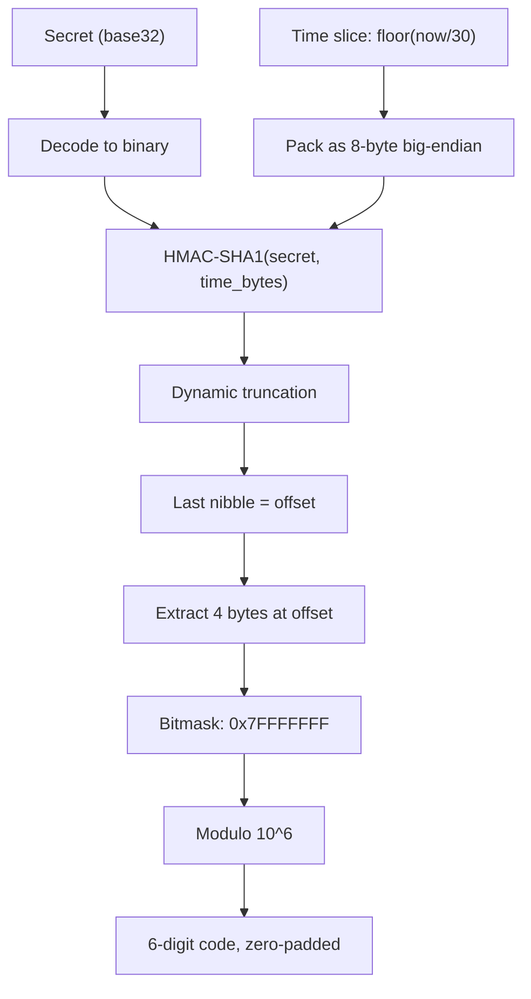

# OTP Verification Flow

> rest-api-mvc-php — OTP generation, validation, expiry

## Overview

**rest-api-mvc-php** implements Time-based One-Time Password (TOTP) two-factor authentication (2FA) using Google Authenticator. After entering valid credentials, users must verify a 6-digit TOTP code from their authenticator app before accessing the system.

| Component | Detail |
|-----------|--------|
| Algorithm | TOTP (RFC 6238) — HMAC-SHA1 based |
| Code Length | 6 digits |
| Time Step | 30 seconds |
| Discrepancy | ±1 interval (4 minutes total window: ±30s) |
| QR Code Provider | api.qrserver.com (Google Charts API v1) |
| Database Table | `users_list_code` |
| Client Library | `app/libraries/OtherClass/GoogleAuthenticator.php` |
| Client Test Page | `other/OTP/OTP_JS.html` (JavaScript TOTP implementation) |

---

## 1. OTP Generation (Registration & Login Setup)

### 1.1 Registration Flow

When a user registers, a TOTP secret is generated and stored:



Code reference (`Users::register()` line 44):
```php
$this->userModel->g2faCodeC();
```

### 1.2 TOTP Secret Creation

`GoogleAuthenticator::createSecret()` generates a cryptographically secure base32 secret:

```php
$pga = new GoogleAuthenticator();
$this->userModel->g2fa = $pga->createSecret(); // 16 chars, base32
```

Secret properties:
- **Length**: 16 characters (80 bits entropy)
- **Encoding**: Base32 (A-Z, 2-7)
- **Generation**: `random_bytes()` → `mcrypt_create_iv()` → `openssl_random_pseudo_bytes()` (fallback chain)

### 1.3 QR Code Generation

The secret is presented to the user as a QR code for Google Authenticator enrollment:

```php
$qr_code = $pga->getQRCodeGoogleUrl(
    $this->userModel->Email,    // Account name
    $this->userModel->g2fa,     // TOTP secret
    'BSC',                       // Issuer/title
    array(300, 300, 'Q')        // QR size and correction level
);
```

QR code URI format (otpauth://):
```
otpauth://totp/user@host.com?secret=BASE32_SECRET&issuer=BSC
```

QR code URL: `https://api.qrserver.com/v1/create-qr-code/?data=otpauth://...&size=300x300&ecc=Q`

### 1.4 First-Time 2FA Setup (Login)

On first login after password verification, `g2faCodeC()` handles OTP setup:



Response from `Users::login()` after password check (line 74-79):
```json
{
  "user_id": 1,
  "md51Key": "user_secret_key_32chars",
  "OtherKey": "g2fa_secret+g2fa_random_salt_32chars",
  "jstKey": "jwt_start_time_from_db",
  "jetKey": "jwt_end_time_from_db",
  "imgKey": "data:image/png;base64,..."
}
```

**HTTP Response**: `202 — User logged in successfully` (2FA required, TOTP verification needed)

---

## 2. OTP Validation

### 2.1 Verification Flow



### 2.2 TOTP Verification Algorithm

`GoogleAuthenticator::verifyCode()` (line 125):

```php
public function verifyCode($secret, $code, $discrepancy = 1, $currentTimeSlice = null)
```

Steps:
1. **Time slice calculation**: `floor(time() / 30)` — current 30-second window
2. **Code length check**: Must be exactly 6 digits
3. **Window search**: Checks `$discrepancy` intervals before and after current time (±1 = check current, previous, and next 30s window)
4. **HMAC comparison**: `timingSafeEquals()` — constant-time comparison to prevent timing attacks
5. **Result**: Returns `true` if any window matches, `false` otherwise

### 2.3 HMAC-SHA1 TOTP Calculation



### 2.4 Timing-Safe Comparison

`GoogleAuthenticator::timingSafeEquals()` (line 231):

```php
if (function_exists('hash_equals')) {
    return hash_equals($safeString, $userString);
}
// Fallback for older PHP
$result = 0;
for ($i = 0; $i < $userLen; ++$i) {
    $result |= (ord($safeString[$i]) ^ ord($userString[$i]));
}
return $result === 0;
```

This prevents timing attacks that could leak the correct OTP code character by character.

### 2.5 Verification Endpoints

| Endpoint | Method | Description |
|----------|--------|-------------|
| `/TOTP` | POST | Verify 2FA code after login (returns 202 on success) |
| `Users::g2faCodeV()` | Internal | Validates OTP code against stored secret |

---

## 3. OTP Expiry and Time Windows

### 3.1 Time Window Rules

| Parameter | Value | Description |
|-----------|-------|-------------|
| **Time step** | 30 seconds | Each OTP code is valid for one 30s window |
| **Discrepancy** | ±1 interval | Accept codes from adjacent 30s windows |
| **Total valid window** | 90 seconds | Current ± 30s before ± 30s after |
| **Code refresh** | Every 30 seconds | New code generated automatically |
| **No expiration** | N/A | Codes don't expire — only time-window based |

### 3.2 Clock Skew Tolerance

The server accepts codes from adjacent 30-second windows to handle clock skew between server and user's device:

```
Time:   [T-30s] [T-0s] [T+30s]
Code:    prev    current   next
         ←─────── valid window ───────→
```

### 3.3 JWT Timestamps (jstKey, jetKey)

The `users_list_code` table stores JWT-related timestamps alongside OTP data:

| Field | Source | Purpose |
|-------|--------|---------|
| `jwt_start_time` | `jstKey` in login response | JWT token validity start |
| `jwt_end_time` | `jetKey` in login response | JWT token validity end |

These define the JWT token lifetime separate from OTP codes. The OTP itself has no expiration — it's purely time-window based.

### 3.4 Session Timeout

Separate from OTP — PHP session timeout from config:

```php
define('SESSION_TIME', 1800); // 30 minutes
```

---

## 4. Database Storage

### 4.1 Table: `users_list_code`

| Column | Type | Description |
|--------|------|-------------|
| `user_id` | int | Foreign key to users table |
| `SecretKey` | varchar(32) | User's secret key (32 char random string) |
| `g2fa` | varchar(16) | TOTP base32 secret (16 chars, generated on first login) |
| `user_ip` | varchar | IP address at creation |

### 4.2 CRUD Operations (User Model)

| Method | Action | Description |
|--------|--------|-------------|
| `g2faCodeC()` | INSERT | Create record in `users_list_code` |
| `g2faCodeR()` | SELECT | Read TOTP record by SecretKey + user_id |
| `g2faCodeU()` | UPDATE | Store generated g2fa secret |
| `g2faCodeD()` | DELETE | Remove TOTP record (account deletion) |

### 4.3 Flow: g2faCodeC (Create/Setup)

```php
public function g2faCodeC(): array
{
    // 1. Check existing record
    $g2faDB = $this->userModel->g2faCodeR();
    
    // 2. Generate or reuse TOTP secret
    $pga = new GoogleAuthenticator();
    $this->userModel->g2fa = $pga->createSecret();
    
    // 3. Store secret if not exists
    if (empty($g2faDB['g2fa'])) {
        $this->userModel->g2faCodeU();
    }
    
    // 4. Generate QR code for Google Authenticator
    $qr_code = $pga->getQRCodeGoogleUrl(...);
    
    // 5. Return auth data
    return [
        'md52Key' => ...,     // 2FA key + salt
        'jstKey'  => ...,     // JWT start time
        'jetKey' => ...,      // JWT end time
        'imgKey'  => ...,     // QR code image
    ];
}
```

---

## 5. Security Considerations

### 5.1 Login Attempt Protection

| Rule | Value | Consequence |
|------|-------|-------------|
| Max failed attempts | 8 | Account locked |
| Lock response | `404 — Failed login attempt limit` | HTTP 404 |
| Tracking table | `users_password_failed` | IP + timestamp per attempt |
| Lock status | UserStatus = 'L' | Prevents login |

### 5.2 OTP Security

| Concern | Mitigation |
|---------|------------|
| **Timing attacks** | `hash_equals()` / `timingSafeEquals()` constant-time comparison |
| **Secret exposure** | Base32 secret never returned to client; only QR code image |
| **QR code interception** | Served over HTTPS (api.qrserver.com) |
| **Brute force** | 8-attempt lockout on failed OTP verification |
| **Replay attacks** | TOTP codes change every 30 seconds |
| **Clock drift** | ±1 interval tolerance (90s total window) |

### 5.3 User Status States

| Status | Code | Login Allowed | Description |
|--------|------|---------------|-------------|
| Active | `E` | Yes | Normal operation |
| Disable | `D` | No | Account disabled |
| Hold | `H` | No | Account held |
| Reset | `R` | No | Password reset required |
| Lock | `L` | No | Account locked (8 failed attempts) |

---

## 6. Client-Side Testing

`other/OTP/OTP_JS.html` provides a browser-based TOTP generator for testing and verification:

- Input base32 secret → displays current OTP code
- Shows HMAC-SHA1 computation, epoch time, hex conversion
- Auto-updates every second (30s countdown)
- QR code preview via Google Charts API
- Uses jsSHA library for HMAC-SHA1 in JavaScript

Purpose: Verify TOTP setup matches between server and client before relying on mobile app.

---

## Reference

- [Auth Flow](../docs/auth-flow.md) — Mermaid flowcharts of the auth state machine (retired raw `Documentation.txt` notation, 2026-09-17)
- [JWT Auth Guide](../docs/jwt-auth.md) — JWT token flow, middleware, validation
- [API Reference](../docs/api.md) — Login endpoint, 2FA response format
- [Architecture](../docs/architecture.md) — Auth state diagram, DB schema
- [GoogleAuthenticator](../app/libraries/OtherClass/GoogleAuthenticator.php) — TOTP library
- [Users Controller](../app/mvc/controllers/Users.php) — g2faCodeC, g2faCodeV
- [User Model](../app/mvc/models/User.php) — g2faCodeC/R/U/D
- [OTP Test Page](../other/OTP/OTP_JS.html) — Client-side TOTP verification
